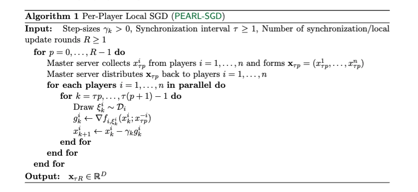
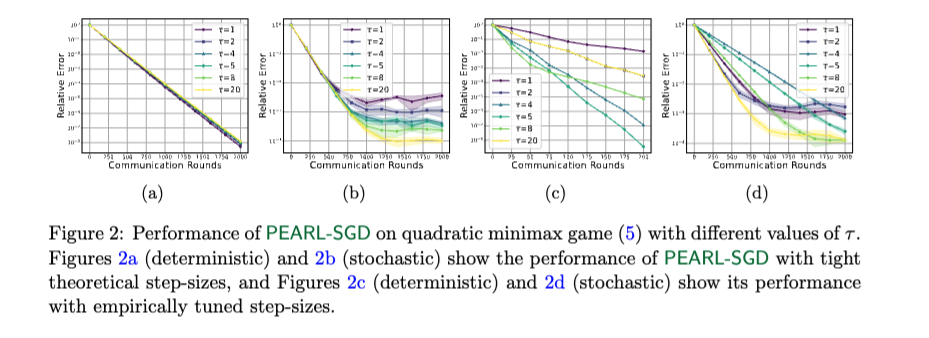
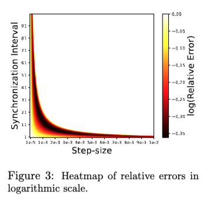
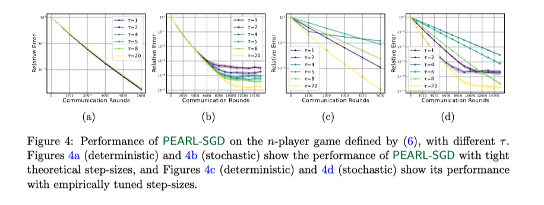

# PEARL-SGD

This repository documents the code to reproduce the experiments reported in the paper:
> [Multiplayer Federated Learning: Reaching Equilibrium with Less Communication](https://arxiv.org/pdf/2501.08263?)

In this work, we introduce Multiplayer Federated Learning (MpFL), a novel framework that models the clients in the FL environment as players in a game-theoretic context, aiming to reach an equilibrium. Each player tries to optimize their utility function in this scenario, which may not align with the collective goal. Within MpFL, we propose Per-Player Local Stochastic Gradient Descent (PEARL-SGD), an algorithm in which each player/client performs local updates independently and periodically communicates with other players.

<p align="center">
  
</p>

This repository evaluates the performance of PEARL-SGD for solving different N-player games. If you use this code for your research, please cite the paper as follows:

```
@article{yoon2025multiplayer,
  title={Multiplayer federated learning: Reaching equilibrium with less communication},
  author={Yoon, TaeHo and Choudhury, Sayantan and Loizou, Nicolas},
  journal={arXiv preprint arXiv:2501.08263},
  year={2025}
}
```

## Table of Contents

<!--ts-->
   * [Quadratic Minimax Game](#quadratic-minimax-game)
   * [Quadratic n-Player Game](#quadratic-n-player-game)
   * [Heatmap](#heatmap)
<!--te-->

## Quadratic Minimax Game
In Figure 2 of our paper, we compare the performance of PEARL-SGD to solve quadratic minimax game for different values of synchronization interval $\tau \in \{ 1, 2, 4, 5, 8 \}$. 

To reproduce the plots in Figure 2, please run the codes in 
  - [Figure 2a](codes/QGv21.ipynb)
  - [Figure 2b](codes/QGv19.ipynb)
  - [Figure 2c](codes/QGv17.ipynb)
  - [Figure 2d](codes/QGv16.ipynb)

## Heatmap
In Figure 3 of our paper, we plot a heatmap for different choices of step size $\gamma$ and synchronization interval $\tau$. 

<p align="center">
  
</p>

To reproduce Figure 3, please run the codes in [Figure 3](codes/QGdetv1.ipynb)
  
## Quadratic n-Player Game
In Figure 4 of our paper, we compare the performance of PEARL-SGD to solve a n-player quadratic game for different values of synchronization interval $\tau \in \{ 1, 2, 4, 5, 8 \}$. 

To reproduce the plots in Figure 4, please run the codes in 
  - [Figure 4a](codes/NPv8.ipynb)
  - [Figure 4b](codes/NPv3.ipynb)
  - [Figure 4c](codes/NPv10.ipynb)
  - [Figure 4d](codes/NPv6.ipynb)


