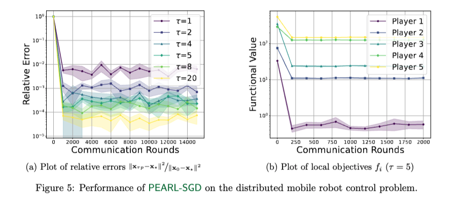

# PEARL-SGD

This repository documents the code to reproduce the experiments reported in the paper:
> [Multiplayer Federated Learning: Reaching Equilibrium with Less Communication](https://arxiv.org/pdf/2501.08263?)

In this work, we introduce Multiplayer Federated Learning (MpFL), a novel framework that models the clients in the FL environment as players in a game-theoretic context, aiming to reach an equilibrium. Each player tries to optimize their utility function in this scenario, which may not align with the collective goal. Within MpFL, we propose Per-Player Local Stochastic Gradient Descent (PEARL-SGD), an algorithm in which each player/client performs local updates independently and periodically communicates with other players.

<p align="center">
  
</p>

This repository provides our implementation of PEARL-SGD on different N-player games considered in the [paper](https://arxiv.org/pdf/2501.08263?). 
If you use this code for your research, please cite the paper as follows:

```
@article{yoon2025multiplayer,
  title={Multiplayer federated learning: Reaching equilibrium with less communication},
  author={Yoon, TaeHo and Choudhury, Sayantan and Loizou, Nicolas},
  journal={arXiv preprint arXiv:2501.08263},
  year={2025}
}
```

## Table of Contents

<!--ts-->
   * [Quadratic Minimax Game](#quadratic-minimax-game)
   * [Heatmap](#heatmap)
   * [Quadratic n-Player Game](#quadratic-n-player-game)
   * [Distributed Mobile Robot Control](#distributed-mobile-robot-control)
   * [Implementation](#implementation)
<!--te-->


## Quadratic Minimax Game
In Figure 2 of our paper, we compare the performance of PEARL-SGD to solve quadratic minimax game for different values of synchronization interval $\tau \in \{ 1, 2, 4, 5, 8 \}$. 

<p align="center">
  
</p>

To reproduce the plots in Figure 2, please run the codes in 
  - [Figure 2a](codes/QGv21.ipynb)
  - [Figure 2b](codes/QGv19.ipynb)
  - [Figure 2c](codes/QGv17.ipynb)
  - [Figure 2d](codes/QGv16.ipynb)

## Heatmap
In Figure 3 of our paper, we plot a heatmap for different choices of step size $\gamma$ and synchronization interval $\tau$. 

<p align="center">
  
</p>

To reproduce Figure 3, please run the codes in [Figure 3](codes/QGdetv1.ipynb).
  
## Quadratic n-Player Game
In Figure 4 of our paper, we compare the performance of PEARL-SGD to solve a n-player quadratic game for different values of synchronization interval $\tau \in \{ 1, 2, 4, 5, 8 \}$. 

<p align="center">
  
</p>

To reproduce the plots in Figure 4, please run the codes in 
  - [Figure 4a](codes/NPv8.ipynb)
  - [Figure 4b](codes/NPv3.ipynb)
  - [Figure 4c](codes/NPv10.ipynb)
  - [Figure 4d](codes/NPv6.ipynb)

## Distributed Mobile Robot Control
In Figure 5 of our paper, we evaluate the performance of PEARL-SGD to solve a distributed control problem.

<p align="center">
  
</p>

To reproduce the plots in Figure 5, please run the codes in 
  - [Figure 5a](codes/RGv4.py)
  - [Figure 5b](codes/RGv5.py)

## Implementation
To implement the algorithm with local steps, follow these steps:
  - **Initialize the Environment:** Set the GPU, random seed, and device.
  - **Define Hyperparameters:** Set the number of communication rounds `N_COMM`, local steps `N_LOCAL_STEP` and number of players `N_PLAYER`.
  - **Generate Game:** Initialize the problems with specific parameters. In `model.py`, we provide the code for initialization of Quadratic Minimax Game, Quadratic n-player game. For instance, one initializes the n-player game as follows:
    ```python
    from model import NPGame
    
    game = NPGame(N_PLAYER, N_DIM, N_DATA, L_A, mu_A, L_B, mu_B, device=device)
    ```
    The `NPGame` class contains the following methods:
      - `objective_function(player, x)`: computes the objective function value $f_i(\mathbf{x})$ of the player with index `player` (corresponds to $i$), where `x` (corresponds to $\mathbf{x}$) is the joint strategy/action vector of all players.
      - `opt_dist(x)`: computes the squared distance to the optimal solution $\lVert \mathbf{x} - \mathbf{x}_\star \rVert^2$. 

  - **Run the Algorithm:** Perform `N_COMM` rounds of local SGD updates, where
      1. Each player updates their own action within `x_local` for `N_LOCAL_STEP` times while keeping other players' action/strategies constant, and
      2. Then synchronizes with others.
    
    Here is the code:

    ```python
         x = x_start.clone().detach().requires_grad_(True)
         for _ in range(N_COMM):
            x_new = torch.zeros((N_PLAYER, N_DIM), requires_grad= True).to(device=device)
            for player in range(N_PLAYER): # In practice, this should be done in parallel, not sequentially
                # save the current values of x before local updates
                x_local = x.clone().detach().requires_grad_(True)
                 
                # perform n_local_step update
                for _ in range(n_local_step):
                    x_local.grad = None
                    loss = game.objective_function(player, x_local)
                    loss.backward()
                    
                    with torch.no_grad():
                        x_local[player] -= lr_x * x_local.grad[player]  # Update only player's own action within x_local
                
                # After local updates, synchronize (send updated x_local[player])
                with torch.no_grad():
                    x_new[player].copy_(x_local[player])
            
            with torch.no_grad():
                x.copy_(x_new) # To be distributed to each players in the next communication round
           
    ```

    For more details, you can view the full implementation [here](codes/model.py).
 


